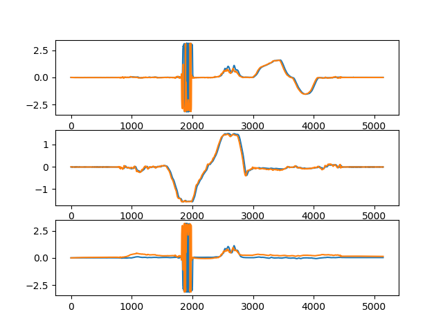

Code for estimating/tracking Orientation in quaternion for a drone system. The method implemented can be found in this [paper](A Quaternion-based Unscented Kalman Filter for Orientation Tracking.pdf) 

1) imu folder has the raw imu data
2) vicon folder has the ground truth data done from the vicon system
3) Total there are 3 sets of datasets - You can add the dataset number as an input argument while execution Eg: "python sample_ukf_test.py 2". (Default is set to 1)
4) You can simply run sample_ukf_test.py to see the UKF tracking the orientation from the IMU data 
5) The data in the graphs is actually Roll,Pitch,Yaw of the orientation obtained by converting the quaternion to Euler Angles.

